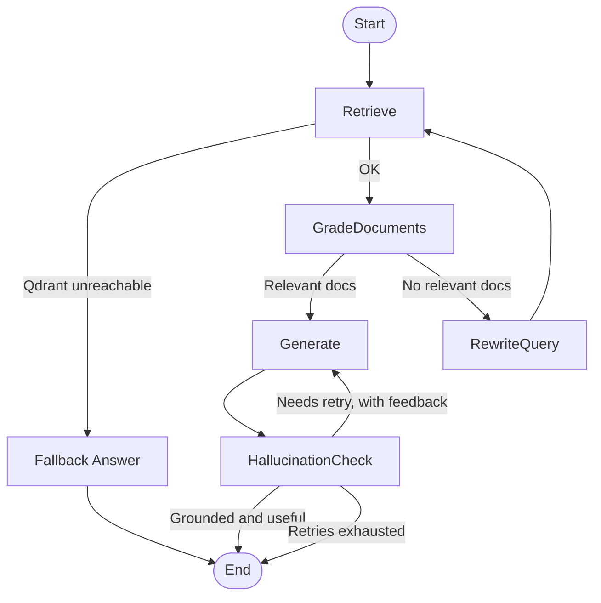

# Advanced RAG Chatbot

[](https://github.com/Mortarion002/Production-rag/actions/workflows/ci.yml)

An advanced Retrieval-Augmented Generation (RAG) system built with **FastAPI**, **LangGraph**, and **Next.js**. This application allows users to upload documents and chat with them using a sophisticated graph-based orchestration engine that ensures high-quality answers through grading, hallucination checks, and query rewriting.

## 🚀 Features

- **Graph-Based RAG**: Uses `LangGraph` to orchestrate a corrective RAG flow:
  - **Retrieval**: Fetches relevant context from Qdrant, with a graceful fallback answer if the vector store is unreachable instead of a failed request.
  - **Grading**: Evaluates document relevance before generation.
  - **Generation**: Produces answers using OpenAI LLMs, incorporating corrective feedback on retries.
  - **Hallucination Check**: Verifies the answer is grounded in the retrieved documents and actually resolves the question; owns the retry loop and caps it at a bounded number of attempts.
  - **Query Rewriting**: Optimizes queries if initial retrieval is poor.
- **Streaming Chat Responses**: `/chat` streams step-by-step progress (retrieving, grading, generating, verifying) via Server-Sent Events, so the UI shows live status instead of a static spinner while the graph runs.
- **Dual-LLM Strategy**: Uses a faster model for routing/grading and a smarter model for generation.
- **Document Ingestion**: Supports uploading PDF, TXT, and MD files with automatic chunking and embedding.
- **Secure Authentication**: JWT-based authentication with role-based access control (User vs. Admin).
- **Modern Frontend**: Built with Next.js 16, TypeScript, Tailwind CSS, and Shadcn/UI.
- **Tested & CI'd**: pytest (backend) and Vitest (frontend) test suites, run automatically via GitHub Actions on every PR.

## 🛠️ Tech Stack

### Backend

- **Framework**: FastAPI
- **Orchestration**: LangGraph, LangChain
- **LLM**: OpenAI (GPT-3.5/4o)
- **Vector Store**: Qdrant
- **Database**: PostgreSQL (for user data)
- **Dependency Manager**: Poetry

### Frontend

- **Framework**: Next.js 16 (App Router)
- **UI Library**: Shadcn/UI, Tailwind CSS
- **State/Fetching**: React Server Components, Axios
- **Form Handling**: React Hook Form (implied)

## 🏗️ Architecture



Each node reports its own progress; `/chat` streams that progress live (see [API Endpoints](#-api-endpoints)) rather than blocking silently until the whole graph finishes.

## 🚀 Getting Started

### Prerequisites

- Python 3.11+
- Node.js 18+
- Docker (optional, for running Qdrant locally)
- OpenAI API Key
- Qdrant Cloud Cluster or Local Instance

### Backend Setup

1. **Navigate to the backend directory:**

   ```bash
   cd backend
   ```

2. **Install dependencies using Poetry:**

   ```bash
   poetry install
   ```

3. **Configure Environment Variables:**
   Create a `.env` file in the `backend` directory:

   ```env
   OPENAI_API_KEY=sk-...
   QDRANT_URL=your-qdrant-url
   QDRANT_API_KEY=your-qdrant-key
   QDRANT_COLLECTION_NAME=rag_collection
   LLM_MODEL_FAST=gpt-3.5-turbo
   LLM_MODEL_SMART=gpt-4o
   SECRET_KEY=your_jwt_secret_key
   ALGORITHM=HS256
   ACCESS_TOKEN_EXPIRE_MINUTES=30
   POSTGRES_USER=postgres
   POSTGRES_PASSWORD=your-db-password
   POSTGRES_DB=rag_metadata
   POSTGRES_HOST=localhost
   POSTGRES_PORT=5432
   ```

   See `backend/.env.example` for the full, authoritative list of variables (`DATABASE_URL` is built from the `POSTGRES_*` values above, not read directly).

4. **Run the Server:**
   ```bash
   poetry run uvicorn app.server:app --reload
   ```

### Frontend Setup

1. **Navigate to the frontend directory:**

   ```bash
   cd frontend
   ```

2. **Install dependencies:**

   ```bash
   npm install
   ```

3. **Run the Development Server:**

   ```bash
   npm run dev
   ```

4. **Access the App:**
   Open [http://localhost:3000](http://localhost:3000) in your browser.

## 🧪 Running Tests

Backend (from `backend/`, no live Qdrant/Postgres needed — an in-memory SQLite DB is used and LLM calls are mocked):

```bash
poetry run pytest
```

Frontend (from `frontend/`):

```bash
npm run test
```

CI (`.github/workflows/ci.yml`) runs both suites plus `lint`/`build` on every PR to `main` and every push to `main` — see the badge at the top of this file.

## 📝 API Endpoints

- **GET /**: Health check.
- **POST /auth/token**: Login and get JWT token.
- **POST /chat**: Protected. Streams the graph's execution as Server-Sent Events — a `step` event per pipeline stage (retrieving, grading, generating, verifying), then a final `done` event with the answer, or an `error` event on failure. Not a single JSON response.
- **POST /ingest**: Ingest raw text (Admin only).
- **POST /ingest/file**: Upload and ingest a file (Admin only).

## 📄 License

This project is licensed under the [Apache License 2.0](LICENSE).

---

*Created by [EternalKnight002](https://github.com/Mortarion002) — Built to learn, optimized for scale.*
